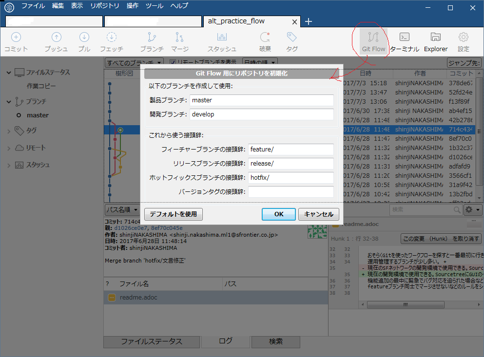

= Gitワークフローについて
:toc: left
:toc-title: 目次
:source-highlighter: coderay

Gitの運用に関して。

== はじめに

GitFlowモデルを採用した場合の運用手順を記述する。 +
Gitのブランチ戦略に関して各モデルの概略はlink:overview.adoc[Gitワークフロー概略]を参照のこと +

== GitFlow概略

基本となるブランチはmasterとdevelopとなる。 +

* masterは、いつでもリリースできるような状態に保つ。 +
リリース準備が完了するまではマージしない。ただし、不具合対応はmastarから分岐する。 +
* developは、開発作業用のブランチとなる。 +
機能追加をする場合はdevelopブランチから分岐する。また、リリース準備もdevelopブランチから分岐する。 +
* featureは、機能追加をするためにdevelopブランチから分岐する。 +
作業が完了したらdevelopブランチにマージし、featureブランチは削除される。 +
* relaseは、リリース準備のためにdevelopブランチから分岐する。 +
もし、そのリリースで何らかの不具合が生じたら、リリースブランチにて修正する。 +
修正作業が発生し、リリースが完了したら、masterとdevelopへ同時にマージし、リリースブランチは削除される。 +
* hotfixは、すでにリリースしたものに対して不具合対応する際に、masterから分岐する。 +
不具合対応が完了したら、masterとdevelopへ同時にマージし、hotfixブランチは削除される。 +
（タグ付けと各環境へのデプロイ、productionへのマージは人力作業） +

image:gitflow/gitflowseq.png[ブランチ戦略１]

---

=== SourceTreeでの準備

* 内蔵Gitを使用する +
「ツール」⇒「オプション」⇒「Git」の画面で、 `内蔵Gitを使用` がONになっていることを確認する。 +
ボタンがグレイアウトになっていれば正解。グレイアウトになっていなければボタンクリックして切り替える。 +
（初めてクリックする場合は、内蔵Gitのダウンロードが開始される） +
image:gitflow/sourcetree_option.png[オプション画面]

* Git Flow init　を実行する。 +
プルしてきた直後にGit Flow の初期化を行う。 +
デフォルトの状態で「OK」ボタンをクリックする。 +

---
=== 機能追加

機能追加作業を始めるには、developからfeatureブランチを分岐する。 +
機能追加の作業が完了したら、developへマージし、追加した機能ごとのfeatureブランチは削除する。 +

==== SouceTreeでの操作

image:gitflow/feature.png[機能追加]

===== 機能追加開始

. 新規フィーチャーを開始
image:gitflow\new_feature.png[新規フィーチャー]
. 名前をつける
image:gitflow\naming_feature.png[フィーチャー命名]
. 完了
image:gitflow\complate_feature.png[フィーチャー作成完]

作成した新規フィーチャーがチェックアウトされている状態なので、機能追加作業を実施する。 +

===== 機能追加完了マージ

機能追加作業が終了したら、そのフィーチャーを「完了」する。 +

. フィーチャー完了ボタンをクリック
image:gitflow\work_comp_feature.png[フィーチャー完了]
. フィーチャー名を確認してOK
image:gitflow\ok_feature.png[フィーチャーOK]

無事に完了すれば、developへのマージとフィーチャーブランチの削除が実行されているはず。 +

---
=== リリース準備

リリース準備は、developからrelaseブランチを分岐する。 +
リリース準備が完了したら、masterとdevelopへマージし、relaseブランチ削除する。 +

==== SouceTreeでの操作
===== リリース準備開始
===== リリース準備完了マージ

---
=== 不具合対応

不具合対応はは、masterからhotfixブランチを分岐する。 +
機能追加の作業が完了したら、masterとdevelopへマージし、hotfixブランチは削除する。 +

==== SouceTreeでの操作
===== 不具合対応開始
===== 不具合対応完了マージ
