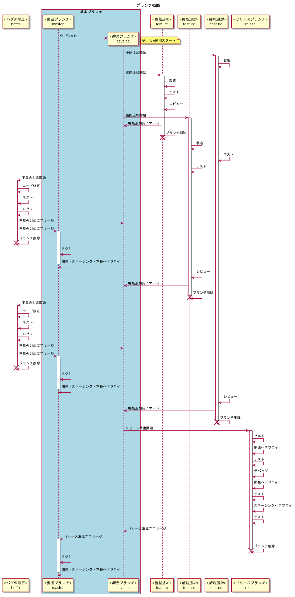

= Gitワークフローについて
:toc: left
:toc-title: 目次
:source-highlighter: coderay

Gitの運用に関して。

まじでまじで

== はじめに

GitFlowモデルを採用した場合の運用手順を記述する。 +
Gitのブランチ戦略に関して各モデルの概略はlink:overview.adoc[Gitワークフロー概略]を参照のこと +

== GitFlow概略

基本となるブランチはmasterとdevelopとなる。 +

* masterは、いつでもリリースできるような状態に保つ。 +
基本的に開発作業ではmasterから分岐やコミットはしない。リリース準備または不具合対応が完了し、リリースができるような状態になって初めてマージする。 +
ただし、hotfixはmasterから分岐する。 +
* developは、開発作業用のブランチとなる。 +
機能追加をする場合はdevelopブランチから分岐する。また、リリース準備もdevelopブランチから分岐する。 +
* featureは、機能追加をするためにdevelopブランチから分岐する。 +
作業が完了したらdevelopブランチにマージし、featureブランチは削除される。 +
「新規フィーチャーを開始」ボタンでdevelopからブランチし、「フィーチャーブランチを完了」ボタンでdevelopへマージする。 +
* relaseは、リリース準備のためにdevelopブランチから分岐する。 +
もし、そのリリースで何らかの不具合が生じたら、リリースブランチにて修正する。 +
修正作業が発生し、リリースが完了したら、masterとdevelopへ同時にマージし、リリースブランチは削除される。 +
「新規リリースを開始」ボタンでdevelopからブランチし、「リリースを完了」ボタンでmasterとdevelopへマージする。 +
* hotfixは、すでにリリースしたものに対して不具合対応する際に、masterから分岐する。 +
不具合対応が完了したら、masterとdevelopへ同時にマージし、hotfixブランチは削除される。 +
（タグ付けと各環境へのデプロイ、productionへのマージは人力作業） +
「新規ホットフィックスを開始」ボタンでmasterからブランチし、「ホットフィックスを完了」ボタンでmasterとdevelopへマージする。 +

---

=== SourceTreeでの準備

* 内蔵Gitを使用する +
「ツール」⇒「オプション」⇒「Git」の画面で、 `内蔵Gitを使用` がONになっていることを確認する。 +
ボタンがグレイアウトになっていれば正解。グレイアウトになっていなければボタンクリックして切り替える。 +
（初めてクリックする場合は、内蔵Gitのダウンロードが開始される） +
image:gitflow/sourcetree_option.png[オプション画面]

* Git Flow init　を実行する。 +
プルしてきた直後にGit Flow の初期化を行う。 +
デフォルトの状態で「OK」ボタンをクリックする。 +
image:gitflow/gitflow_init.png[GitFlow初期化]

---
=== 機能追加

機能追加作業を始めるには、developからfeatureブランチを分岐する。 +
機能追加の作業が完了したら、developへマージし、追加した機能ごとのfeatureブランチは削除する。 +

==== SouceTreeでの操作

===== 機能追加開始

. 新規フィーチャーを開始 +
image:gitflow\new_feature.png[新規フィーチャー]
. 名前をつける +
image:gitflow\naming_feature.png[フィーチャー命名]
. 完了 +
image:gitflow\complate_feature.png[フィーチャー作成完]

作成した新規フィーチャーがチェックアウトされている状態なので、機能追加作業を実施する。 +

===== 機能追加完了マージ

機能追加作業が終了したら、そのフィーチャーを「完了」する。 +

. フィーチャー完了ボタンをクリック +
image:gitflow\work_comp_feature.png[フィーチャー完了]
. フィーチャー名を確認してOK +
image:gitflow\ok_feature.png[フィーチャーOK]

無事に完了すれば、developへのマージとフィーチャーブランチの削除が実行されているはず。 +

---
=== リリース準備

予定していた機能追加がすべて完了したら、リリース準備に入る。 +
リリース準備は、developからrelaseブランチを分岐する。 +
リリース準備が完了したら、masterとdevelopへマージし、relaseブランチ削除する。 +

==== SouceTreeでの操作

image:gitflow\relase.png[リリース]

===== リリース準備開始

. 新規リリースを開始 +
image:gitflow\new_feature.png[新規リリース]
. 名前をつける +
image:gitflow\naming_relase.png[リリース命名]
. 完了 +
image:gitflow\complate_relase.png[リリース作成完]

作成した新規リリースがチェックアウトされている状態なので、リリース作業を実施する。 +
リリース作業で不具合が発生したら、このブランチで作業をする。 +

===== リリース準備完了マージ

リリース作業が終了したら、そのリリースを「完了」する。 +

. リリース完了ボタンをクリック +
image:gitflow\work_comp_relase.png[リリース完了]
. リリース名を確認してOK +
image:gitflow\ok_lelase.png[リリースOK]

無事に完了すれば、developとmasterへのマージとリリースブランチの削除が実行されているはず。 +
masterが更新されたので、本番環境などへのデプロイを行う。 +
本番デプロイが無事に完了したら、masterブランチをproductionブランチへマージする（手動作業）。 +

---
=== 不具合対応

不具合対応はは、masterからhotfixブランチを分岐する。 +
機能追加の作業が完了したら、masterとdevelopへマージし、hotfixブランチは削除する。 +

==== SouceTreeでの操作

image:gitflow\hotfix.png[不具合対応]

===== 不具合対応開始

. 新規ホットフィックスを開始 +
image:gitflow\new_feature.png[新規ホットフィックス]
. 名前をつける +
image:gitflow\naming_hotfix.png[ホットフィックスx命名]
. 完了 +
image:gitflow\complate_hotfix.png[ホットフィックス作成完]

作成した新規ホットフィックスがチェックアウトされている状態なので、ホットフィックス作業を実施する。 +

===== 不具合対応完了マージ

不具合対応作業が終了したら、そのホットフィックスを「完了」する。 +

. ホットフィックス完了ボタンをクリック +
image:gitflow\work_comp_hotfix.png[ホットフィックス完了]
. ホットフィックス名を確認してOK +
image:gitflow\ok_hotfix.png[ホットフィックスOK]

無事に完了すれば、developとmasterへのマージとリリースブランチの削除が実行されているはず。 +
masterが更新されたので、本番環境などへのデプロイを行う。 +
本番デプロイが無事に完了したら、masterブランチをproductionブランチへマージする（手動作業）。 +

== 自分の機能追加をブランチした後にdevelopブランチの更新が進んじゃったらどうするか？

いちどfeatureブランチを分岐してのちの作業中に、hotfix作業が入った場合は、developブランチが進むことになる。 +
その場合は、現在作業中のfeatureに対してdevelopブランチをマージすること。 +
コンフリクトが起こったら？　頑張って直してください。 +
